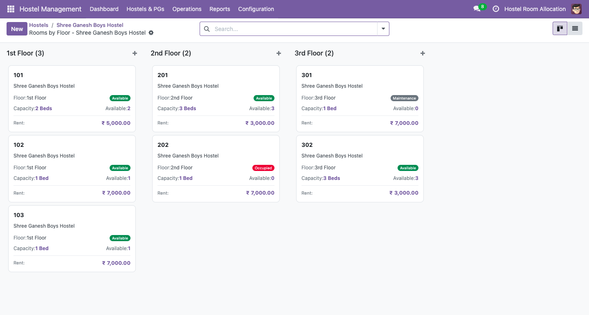
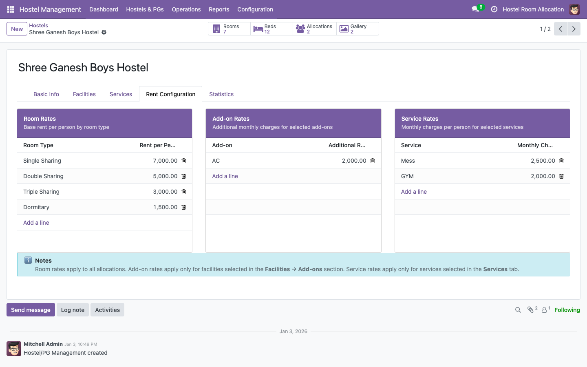

# odoo-hostel-management

Odoo 18 module: Full hostel and paying-guest (PG) accommodation management.

Built as a portfolio project demonstrating real-world property + billing
workflows in Odoo 18 Community.

## What it does

| Feature | Detail |
|---|---|
| Hostel & PG setup | Multi-hostel support, floor-wise room organisation, gallery images |
| Room management | Room types, bed capacity, add-ons, AC flag, maintenance toggle |
| Tenant management | Partner-linked tenants, ID proof, portal access control |
| Bed-level allocation | Hostel → Room → Bed hierarchy, availability computed in real time |
| Rent engine | Base rent + add-on rates + per-person service charges, all hostel-configurable |
| Security deposit | Full lifecycle: invoice → receive → refund credit note |
| Invoicing | Monthly rent invoices via cron, payment status tracking |
| Occupancy reports | Daily / monthly / detailed, filterable by hostel and room type |
| Portal access | Tenants can view their allocation and invoices via Odoo portal |

## Tech used

`ORM`, `QWeb`, `mail.thread`, `mail.activity.mixin`, `TransientModel` (report wizard),
`post_init_hook`, `_sql_constraints`, `api.depends`, `api.constrains`,
`model_create_multi`, portal controller, `account.move` inheritance.

## Screenshots




## Install

Requires Odoo 18 Community with `account`, `portal`, and `contacts` installed.

```bash
./odoo-bin -c odoo.conf -i hostel_management
```

## Author

Mayuri Patil — Odoo Functional + Technical Consultant  
[LinkedIn](https://linkedin.com/in/mayuri-patil-2392) · [GitHub](https://github.com/mayuri2392)