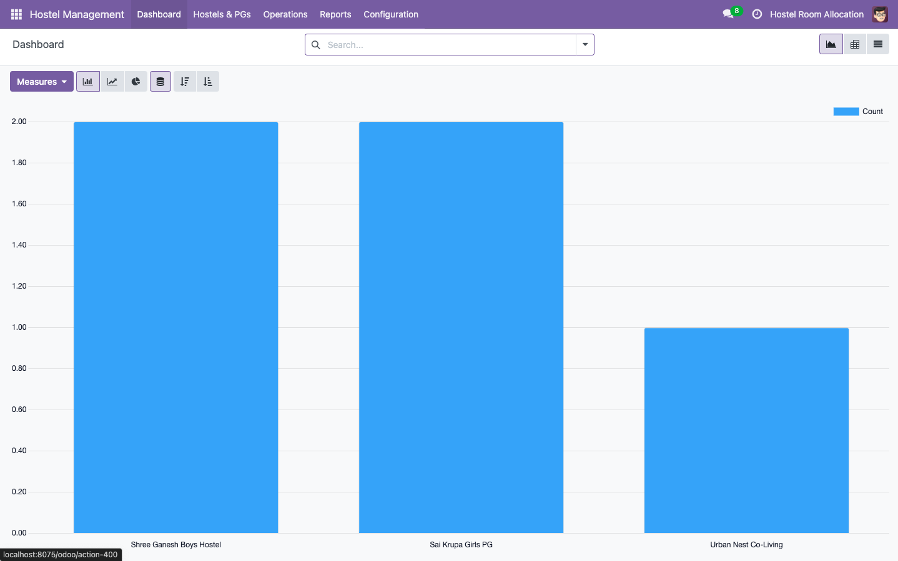
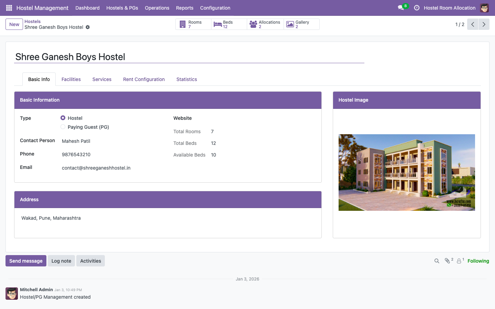
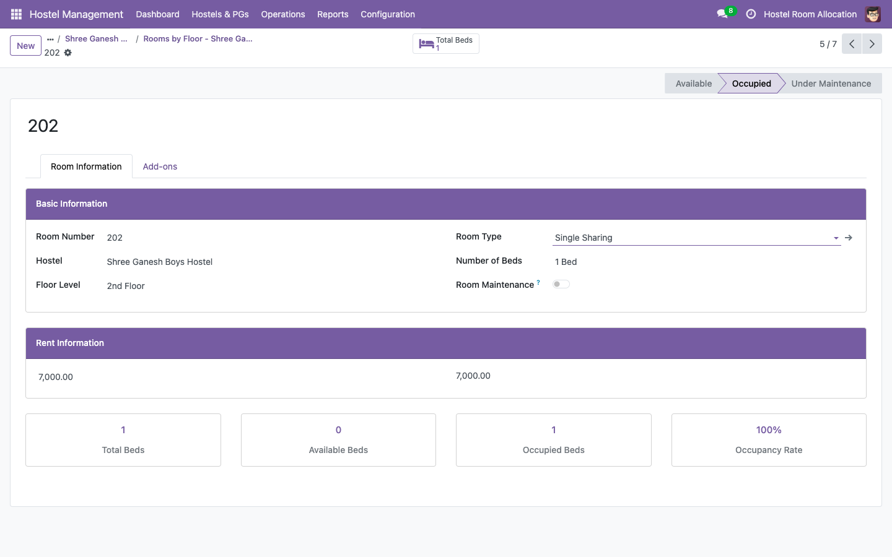
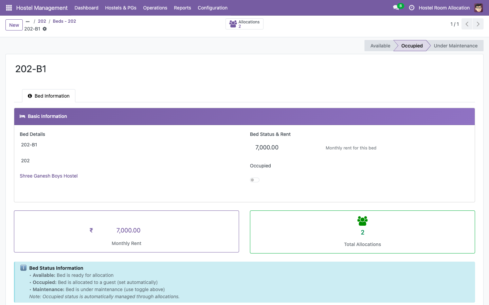
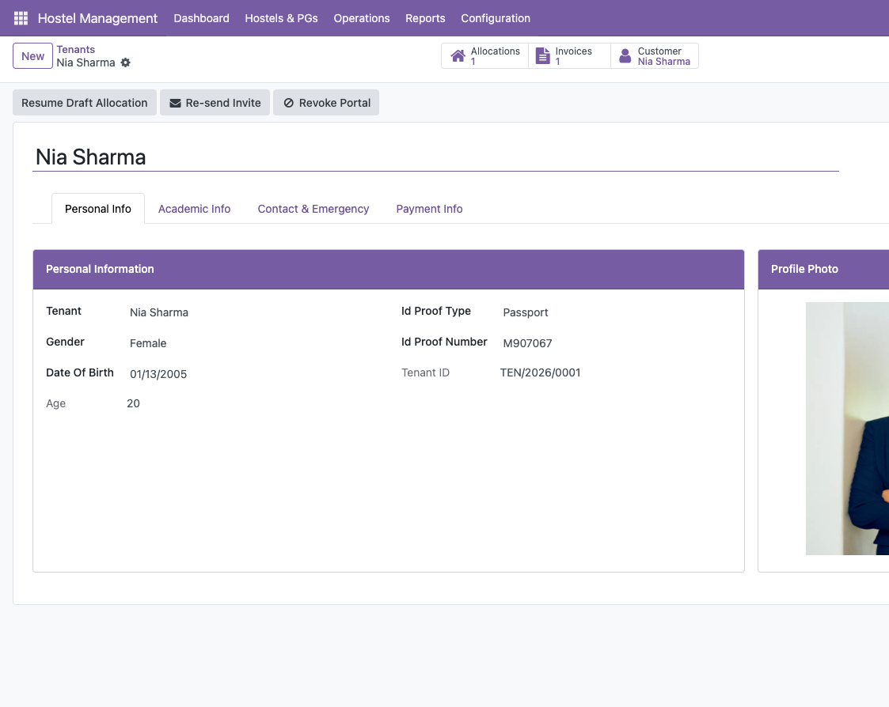
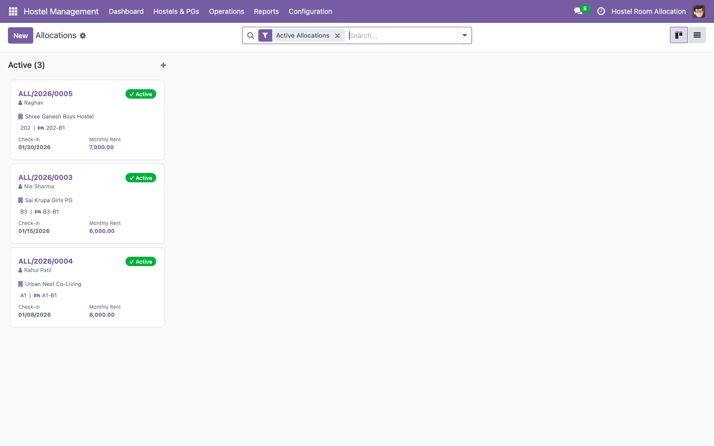
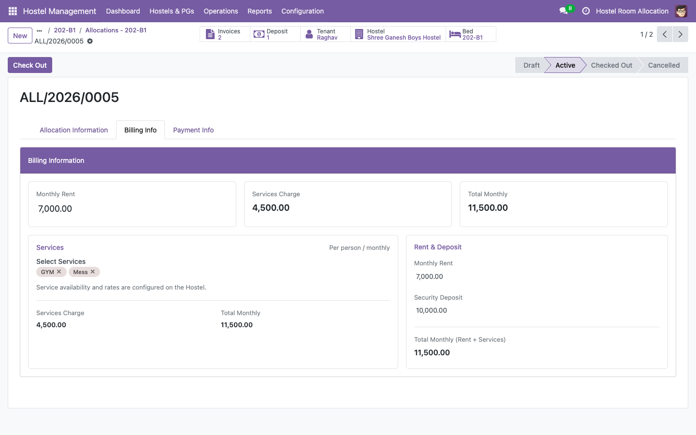
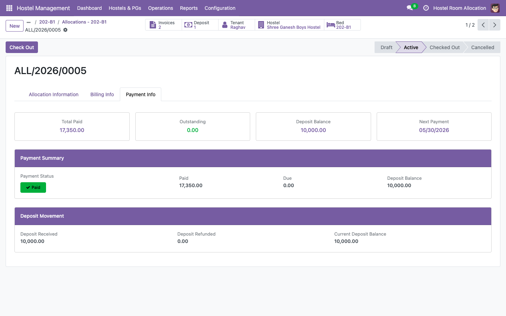
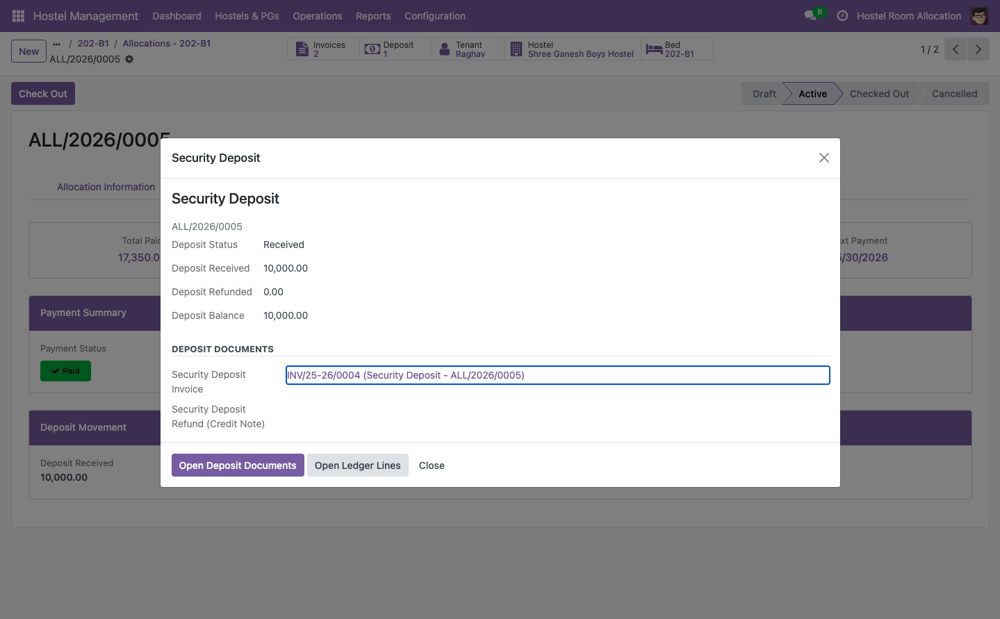
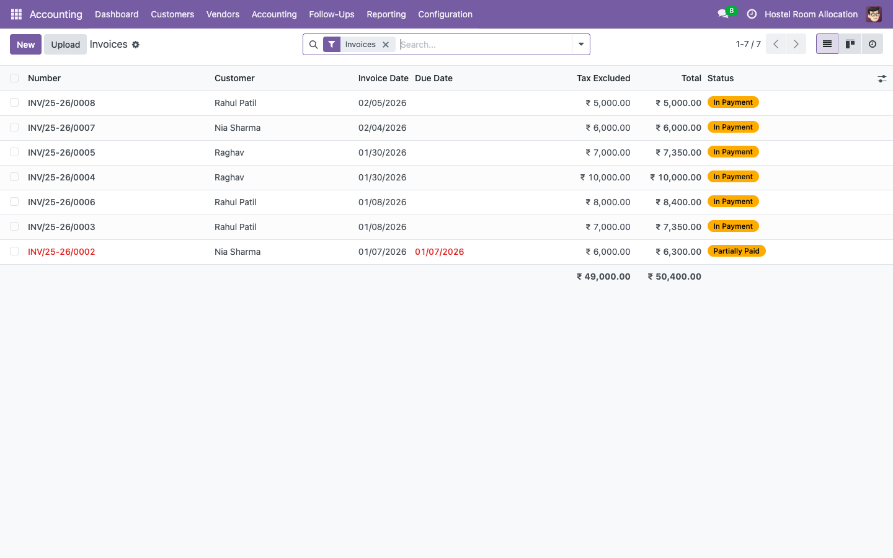

# odoo18-hostel-management

An Odoo 18 module for managing hostels end-to-end — rooms, beds, tenant allocations, billing, security deposits, and portal access — all within a single structured hierarchy.


Built on Odoo 18 Community. Tested with the Invoicing and Contacts apps.

---

## Table of Contents

- [What It Does](#what-it-does)
- [Screenshots](#screenshots)
- [Module Structure](#module-structure)
- [Installation](#installation)
- [Workflow Overview](#workflow-overview)
- [Technical Notes](#technical-notes)
- [License](#license)
- [Author](#author)

---

## What It Does

### Property Management

- Organises properties into a Hostel → Room → Bed hierarchy with configurable room types and facility types
- Tracks occupancy at the bed level with a dashboard showing current and available beds across all floors
- Supports multiple room types (Single, Double, Dormitory) and facility types (AC, Attached Bath, WiFi, and others)

### Tenant Management

- Maintains tenant profiles with contact details, ID documents, and full allocation history
- Sends portal invitations so tenants can log in and view their own invoices and payment status
- Lets staff re-send invitations or revoke portal access directly from the tenant record

### Allocations and Billing

- Links a tenant to a specific bed for a defined period with a monthly rent amount
- Generates monthly rent invoices automatically via a scheduled cron job
- Tracks payment status against each allocation with a billing summary tab on the allocation record

### Security Deposits

- Records the security deposit amount at allocation time
- Raises a deposit invoice and marks it received when payment is confirmed
- Refunds the deposit at end of tenancy via a credit note — full lifecycle tracked on the allocation record

---

## Screenshots

### Occupancy Dashboard


Summary view of occupied and available beds across all hostels and floors. Staff can see capacity at a glance without drilling into individual records.

### Hostel Record


The top-level hostel record with address, contact details, and a summary of all rooms and floors linked to the property.

### Rooms by Floor


Rooms organised by floor within a hostel. Room type, capacity, and current occupancy status are visible in the list.

### Room Detail


Individual room record with room type, facilities, floor, and a list of all beds. Bed status (available, occupied) updates automatically from allocations.

### Bed Detail


Individual bed record showing current tenant, allocation start date, and occupancy status. Status updates automatically when an allocation is opened or closed.

### Tenant Profile


Tenant record with contact details, ID document fields, portal access status, and a history of all past and current allocations.

### Active Allocations


List view of all active allocations across the property. Filterable by hostel, floor, room, or tenant.

### Allocation and Billing


The Billing tab on an allocation record showing generated rent invoices, invoice dates, and amounts.

### Allocation Payment Status


Payment status per invoice on the allocation. Unpaid and partially paid invoices are clearly flagged.

### Security Deposit Lifecycle


The security deposit section on the allocation record — deposit invoice, received status, and refund credit note all in one place.

### Invoice List


Full invoice list for the hostel filtered by property. Covers both rent invoices and security deposit invoices in the standard Odoo Accounting view.

---

## Module Structure

```
hostel_management/
├── __manifest__.py
├── __init__.py
├── models/
│   ├── __init__.py
│   ├── hostel.py                  # hostel.hostel — top-level property record
│   ├── hostel_room.py             # hostel.room — room with type and facilities
│   ├── hostel_bed.py              # hostel.bed — individual bed, occupancy status
│   ├── hostel_tenant.py           # hostel.tenant — tenant profile, portal access
│   └── hostel_allocation.py       # hostel.allocation — tenancy, billing, deposit
├── views/
│   ├── hostel_views.xml
│   ├── hostel_room_views.xml
│   ├── hostel_bed_views.xml
│   ├── hostel_tenant_views.xml
│   ├── hostel_allocation_views.xml
│   └── hostel_dashboard_views.xml
├── security/
│   └── ir.model.access.csv
└── static/src/img/screenshots/
```

---

## Installation

```bash
git clone https://github.com/mayuri2392/odoo18-hostel-management ~/Projects/odoo18/custom_addons/hostel_management
```

Restart Odoo, enable developer mode, then install **Hostel Management** from the Apps menu.

**Post-install setup:**

1. Configure room types under **Hostel → Configuration → Room Types**
2. Configure facility types under **Hostel → Configuration → Facility Types**
3. Configure service types under **Hostel → Configuration → Service Types**
4. Create your first hostel record, then add floors, rooms, and beds
5. Create tenant profiles and assign them to beds via Allocations

---

## Workflow Overview

### Onboarding a New Tenant

1. Create a tenant record under **Hostel → Tenants** with contact and ID details
2. Go to **Hostel → Allocations → New** — select the tenant, bed, start date, and monthly rent amount
3. Set the security deposit amount and click **Invoice Deposit** to raise the deposit invoice
4. Mark the deposit as received once payment is confirmed
5. Optionally send a portal invitation from the tenant record so they can view their own invoices

### Monthly Rent Billing

1. The monthly rent cron runs automatically and generates invoices for all active allocations
2. Staff can review unpaid invoices from the **Allocation → Billing** tab or the main invoice list
3. Payments are posted against each invoice in the standard Odoo Accounting flow

### End of Tenancy

1. Set the allocation end date and change the status to Closed
2. Click **Refund Deposit** on the allocation to generate a credit note for the security deposit amount
3. The bed status updates to Available automatically

---

## Technical Notes

- Tenant portal access uses Odoo's standard `res.partner` portal invite mechanism — no custom authentication code.
- The monthly rent cron is defined in the module and can be adjusted under **Settings → Technical → Scheduled Actions**.
- Security deposit lifecycle (invoice → received → refund credit note) is tracked entirely on the allocation record for a clean audit trail.
- Compatible with Odoo 18 Community. No Docker required for local development.

---

## License

[LGPL-3](LICENSE)

---

## Author

**Mayuri Patil** — Odoo Functional + Technical Consultant

6 years across B2B retail, logistics, and perishable goods. Open to EU roles.

[](https://linkedin.com/in/mayuri-patil-2392)
[](https://github.com/mayuri2392)